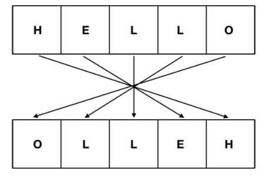
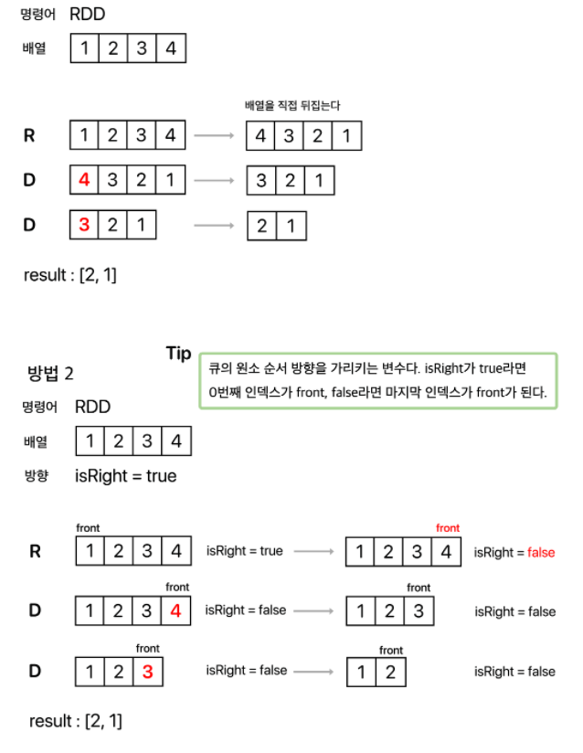

# 문제접근

많은 문제를 효율적으로 풀기위해 문제를 보고 어떻게 풀것인지 공부하기

1. 문자열, 배열, 큐, 스택, 해시맵, 재귀, 트리
2. 탐색, graph
3. DP

## 5430 AC

### 나의접근

1. T만큼 for문 실행
2. queue에 실행함수 순서대로 넣기
3. n만큼 배열 만들기
4. 받아온 문자를 [1,2,3,4]를 문자를 분해해서 각 숫자로 받아옴
5. queue길이만큼 for문 실행하기
6. R이면 문자열 바꾸기(reverse나 for문 사용하여 바꿈) / D면 문자열 앞에 삭제(문자열이 없다면 error 정지)
7. error가 안나면 문자열 출력
8. 2번으로 돌아와 T가 0이 될때까지 실행

시간 복잡도 생각해서 문자열 순서 바꿀때는 아래 그림과 같이 바꿀것  

### 다른 풀이

이렇게 생각했지만 뒤집는 과정을 다르게 생각할 수 도 있음  
문자열을 뒤집지않고 가르키는 방향에 따라 나중에 출력

### 고친 나의 풀이

1. T만큼 for문 실행
2. queue에 실행함수 순서대로 넣기
3. n만큼 배열 만들기
4. 받아온 문자를 [1,2,3,4]를 문자를 분해해서 각 숫자로 받아옴
5. queue길이만큼 for문 실행하기
6. R: 문자열을 가리키는 포인터 바꾸기 `OR` D: 가르키는 포인터 인덱스 삭제후 포인터(다음칸 or 전칸) 이동 앞에 삭제(문자열이 없다면 error 정지)
7. error가 안나면 문자열 출력
8. 2번으로 돌아와 T가 0이 될때까지 실행

### 주의할점

1. 문자열 받아올 때 어떻게 받아올것인지
2. 문자열 반전할 때 방법
3. 문자 삭제

> **출처**  
> https://sabarada.tistory.com/151  
> https://st-lab.tistory.com/221

## 1764 듣보잡

### 나의접근
1. 듣지못한사람 + 보도 못한사람 배열만들어 정렬(가장빠른 정렬) 하기
2. 순차적으로 탐색해서 스택에 현재있던것을 삽입하고 스택top과 같다면 둘다 pop하여 정답에 넣기
3. 그렇지 않으면 스택top을 pop하고 현재것을 넣기 
4. 정답 출력

## 1541 잃어버린 괄호

### 나의접근
1. 문자열을 차례로 탐색
2. 숫자면    

### 다른풀이
  

### 고친 나의 풀이

> **출처**  

